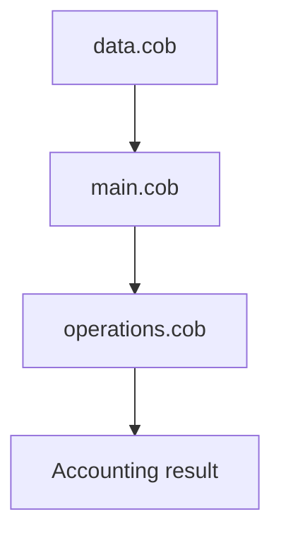

# Legacy COBOL Explanation

The `data.cob` file defines account records and the data layout used by the legacy program.

The `main.cob` file coordinates input, calls operations, and prints the accounting results.

The `operations.cob` file contains the business rules for debit and credit calculations.

